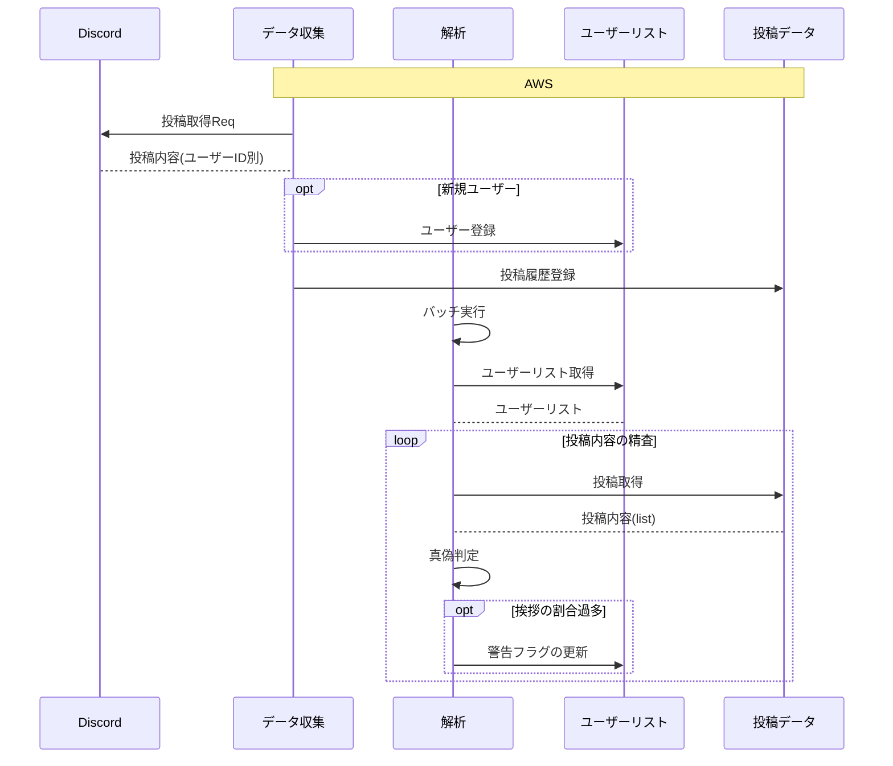

```mermaid 
sequenceDiagram
participant Discord as Discord
participant EC2 as データ収集
participant Lambda as 解析
participant DB01 as ユーザーリスト
participant DB02 as 投稿データ
Note over EC2, DB02: AWS

EC2->>Discord     : 投稿取得Req
Discord-->EC2     : 投稿内容(ユーザーID別)
opt 新規ユーザー
    EC2->> DB01       : ユーザー登録
end
EC2->> DB02       : 投稿履歴登録
Lambda->>Lambda   : バッチ実行
Lambda->>DB01     : ユーザーリスト取得
DB01--> Lambda    : ユーザーリスト
Loop 投稿内容の精査
    Lambda->>DB02     : 投稿取得
    DB02--> Lambda    : 投稿内容(list)
    Lambda->>Lambda   : 真偽判定
    opt 挨拶の割合過多
        Lambda->>DB01     : 警告フラグの更新
    end
end
```