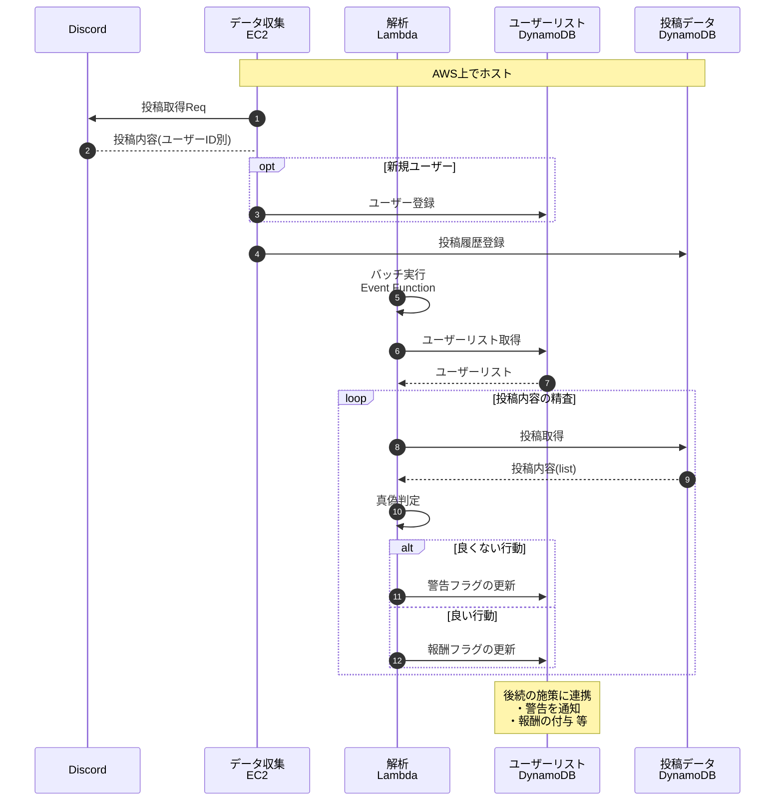

```mermaid 
sequenceDiagram
autonumber
participant Discord as Discord
participant EC2     as データ収集<br>EC2
participant Lambda  as 解析<br>Lambda
participant DB01    as ユーザーリスト<br>DynamoDB
participant DB02    as 投稿データ<br>DynamoDB
Note over EC2, DB02: AWS上でホスト

EC2->>Discord     : 投稿取得Req
Discord-->EC2     : 投稿内容(ユーザーID別)
opt 新規ユーザー
    EC2->> DB01       : ユーザー登録
end
EC2->> DB02       : 投稿履歴登録
Lambda->>Lambda   : バッチ実行<br>Event Function
Lambda->>DB01     : ユーザーリスト取得
DB01-->>Lambda    : ユーザーリスト
Loop 投稿内容の精査
    Lambda->>DB02     : 投稿取得
    DB02-->>Lambda    : 投稿内容(list)
    Lambda->>Lambda   : 真偽判定
    alt 良くない行動
        Lambda->>DB01 : 警告フラグの更新
    else 良い行動
        Lambda->>DB01 : 報酬フラグの更新
    end
end
Note over DB01    : 後続の施策に連携<br>・警告を通知<br>・報酬の付与 等
```