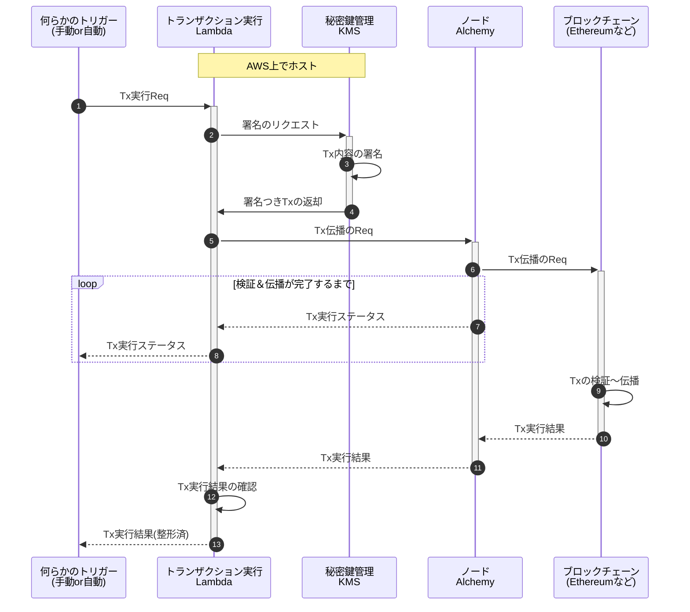

```mermaid 
sequenceDiagram
autonumber
participant Trigger as 何らかのトリガー<br>(手動or自動)
participant Lambda  as トランザクション実行<br>Lambda
participant Kms     as 秘密鍵管理<br>KMS
participant Node    as ノード<br>Alchemy
participant Bc      as ブロックチェーン<br>(Ethereumなど)

Note over Lambda, Kms: AWS上でホスト

Trigger->>+ Lambda   : Tx実行Req
Lambda->>+ Kms       : 署名のリクエスト
Kms->> Kms           : Tx内容の署名
Kms->>- Lambda       : 署名つきTxの返却
Lambda->>+ Node      : Tx伝播のReq
Node->>+ Bc          : Tx伝播のReq
Loop 検証＆伝播が完了するまで
    Node-->>Lambda   : Tx実行ステータス
    Lambda-->>Trigger: Tx実行ステータス
end
Bc->> Bc             : Txの検証〜伝播
Bc-->>- Node         : Tx実行結果
Node-->>- Lambda     : Tx実行結果
Lambda->> Lambda     : Tx実行結果の確認
Lambda-->>- Trigger  : Tx実行結果(整形済)


```