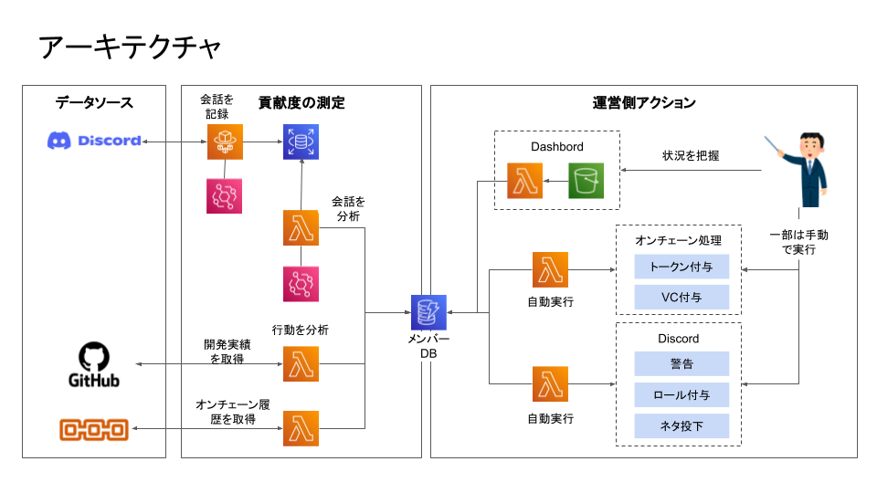

# 機能設計書

## 環境情報
| 分類 | 環境 |　補足 |
----|---- |----
フロントエンド| Discord | コミュニティメンバーのUI
フロントエンド| Web App(React) | コアメンバー・運営の管理UI
バックエンド (オフチェーン)| Polygon | ガス代考慮して選択。随時追加
バックエンド (オンチェーン)| AWS | 使用サービスは機能一覧を参照
バックエンド (ノード)| Alchemy | -

## 概念図

## 機能一覧
| 分類 | 機能 |　初期スコープ |
----|---- |----
| 貢献度の測定 | [Discordの会話分析](#1-1-Discordの会話分析) |○| 
| 貢献度の測定 | [オンチェーン情報に基づく測定](#1-2-オンチェーン情報に基づく測定) |△|
| 貢献度の測定 | [オフチェーン情報に基づく測定](#1-3-オフチェーン情報に基づく測定) |×|
| 運営アクション | [ダッシュボード](#2-1-ダッシュボード) |×|
| 運営アクション | [トークン発行](#2-2-トークン発行) |○|
| 運営アクション | [VC実行](#2-3-VC発行) |×|
| 運営アクション | [会話ネタの投稿](#2-4-ネタの投稿) |×| 

## 各機能の説明
### 1. 貢献度の測定
#### **1-1. Discordの会話分析**

* 投稿内容を精査してエンゲージメントの高い/低い参加者をリスト化する
* リスト化したユーザーに対して適切なアクションを行うことでコミュニティの純度を高める
* [シーケンス図](1-1_Discordコメント分析seq.md)

#### **1-2. オンチェーン情報に基づく測定**

* オンチェーン上のデータを解析し、ロールを付与などのアクションに活かす
* 案1: クリプト歴長い人を特定しての高位のロール付与
* 案2: 他DAOでの投票実績に基づく専門家ロールの付与(DeFiの意思決定に関与が多い人->DeFi監査人 など)

#### **1-3. オフチェーン情報に基づく測定**

* オフチェーン上のデータを解析し、ロールを付与などのアクションに活かす
* 案1: Githubでのリポジトリを参照した開発者ロール付与(フロント/バックエンドなども可能な限り分類)
* 案2: SNSのフォロワーすうに基づくインフルエンサーロール付与

### 2. 運営アクション
#### **2-1. ダッシュボード**

* 上記1によって集約された情報をダッシュボードにて表示する

#### **2-2. トークンの発行**

* 上記1によって集約されたユーザーリストやその他の条件に基づき、対象ユーザーに対してトークンを付与する
* ガス代などの問題もあるため、コアメンバーの承認フローなども設ける
* [シーケンス図](2-2_トークンの自動発行.md)

#### **2-3. VCの発行**

* 上記1によって集約されたユーザーリストやその他の条件に基づき、対象ユーザーに対してVCを発行し、付与する
* ガス代などの問題もあるため、コアメンバーの承認フローなども設ける

#### **2-4. ネタの投稿**

* 会話のきっかけとなるネタを定期的に投稿し、コミュニティを活性化させる
* 案1: 早押しクイズを投稿して、最初の回答者にポイント付与
* 案2: ランダムにユーザーとお題を指定して話始めてもらう

